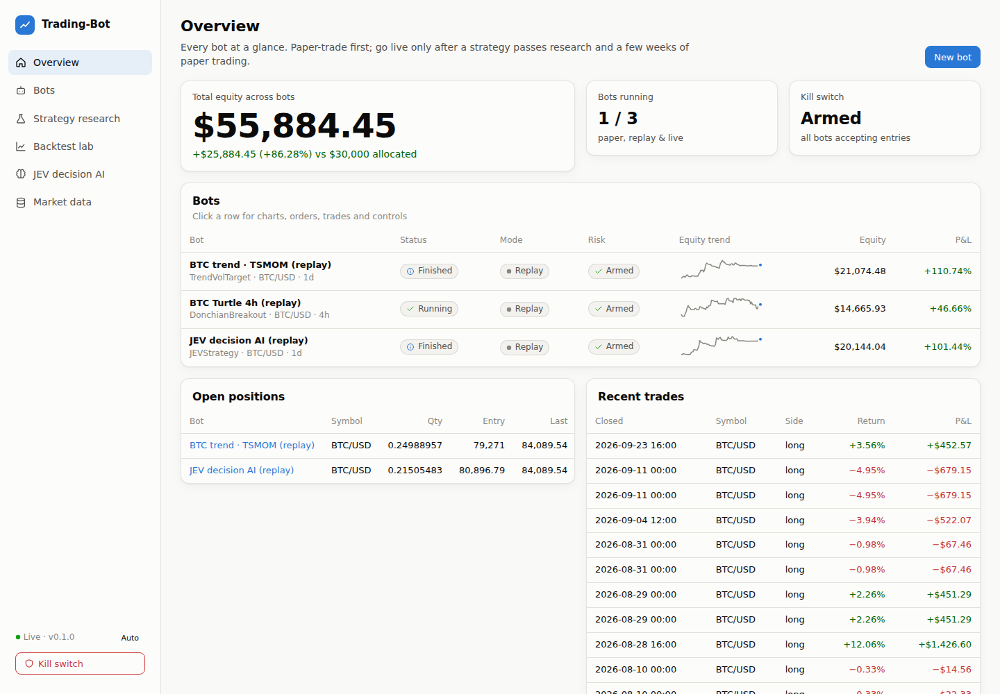
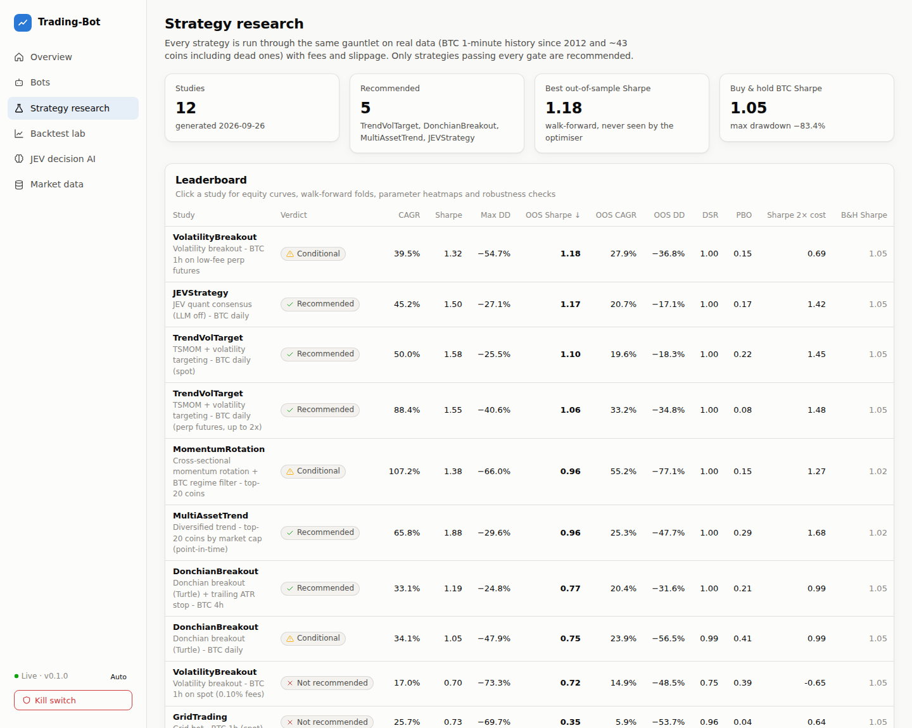
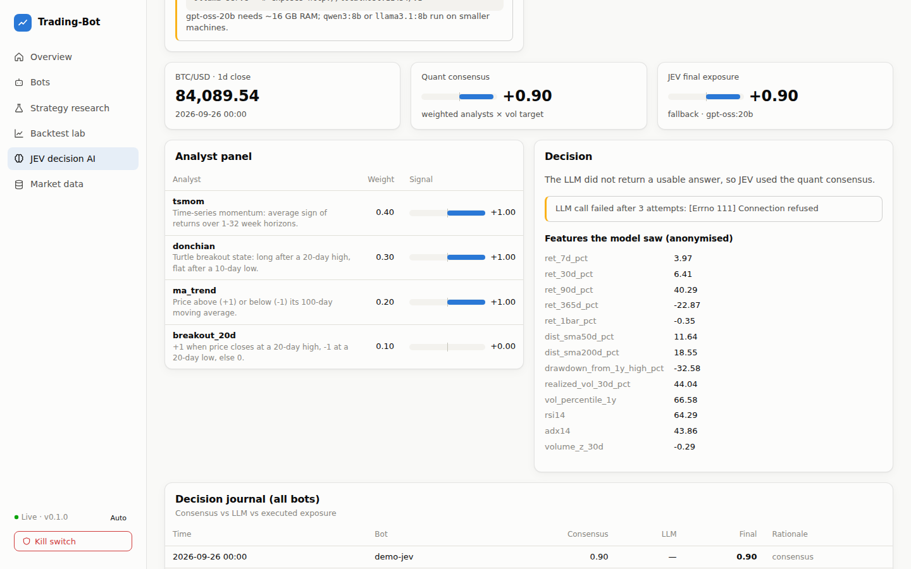
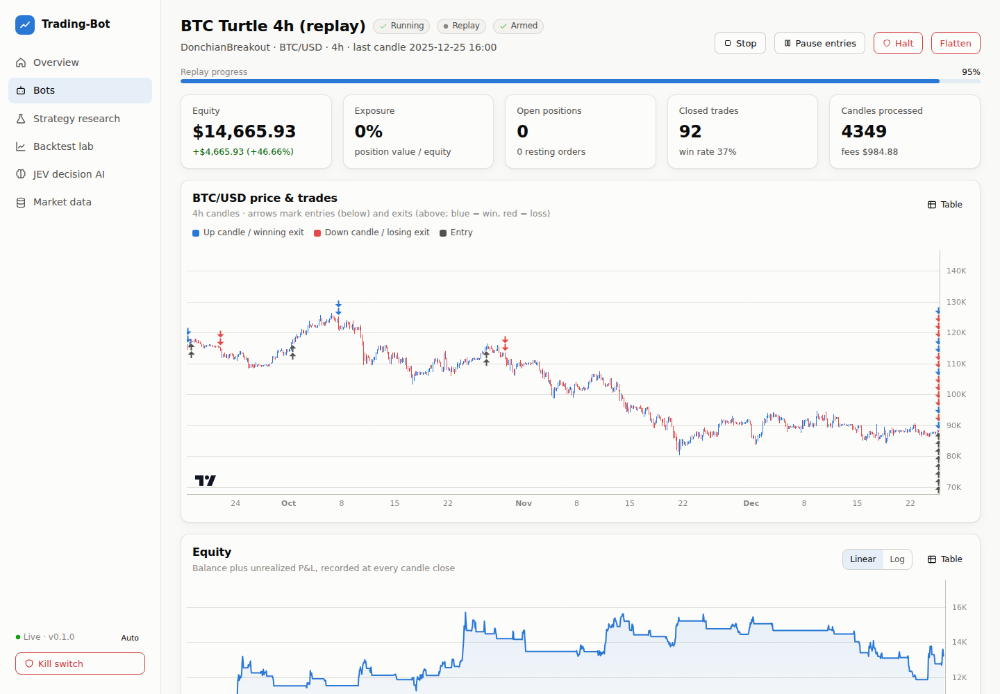

# Trading-Bot

**An open-source algorithmic trading platform — research, backtesting, paper & live trading, a web dashboard, and JEV: an open-source decision-making AI you run yourself.**

[](https://github.com/aaronwins356/Trading-Bot/actions/workflows/ci.yml)
 



- **Validated strategies, not hype.** 12 strategy studies on real data (BTC 1-minute history since 2012; ~43 coins including dead ones), with fees and slippage, walk-forward out-of-sample tests, Deflated Sharpe Ratio, probability of backtest overfitting, cost stress, bootstrap, and look-ahead checks. Only 4 strategy families passed every gate.
- **JEV — the decision AI.** An open-weight LLM (`gpt-oss`, Qwen, Llama… via Ollama/vLLM) reasons over the validated quant signals and decides the target exposure — inside hard guardrails it can never bypass.
- **Jesse-style strategy API** (`should_long`, `go_long`, `update_position`, `self.buy = (qty, price)`) plus a target-weight portfolio API.
- **One engine everywhere.** The same strategy classes and the same ledger code run in backtest, paper, and live; a parity test proves replayed live trading reproduces the backtest trade-for-trade.
- **Industry-standard safety.** Pre-trade risk gates, kill switch with manual re-arm, daily-loss pause, drawdown halt, Freqtrade-style protections, idempotent client order IDs, exchange reconciliation, full audit trail.
- **100+ exchanges via [CCXT](https://github.com/ccxt/ccxt)**, a React dashboard, REST + WebSocket API, Telegram/Discord alerts, Docker, CI, 103 tests.

> ⚠️ Trading is risky. Backtests are simulations, not promises. Paper trade first. Nothing here is financial advice.

---

## What the research found

Full-period backtests from 2015 (BTC) / 2017 (altcoins) to September 2026, costs included. **OOS** = walk-forward out-of-sample: parameters re-optimised on a rolling 3-year (2-year for alts) window, then traded blind for the next year.

| Strategy | Verdict | CAGR | Sharpe | Max DD | OOS Sharpe | OOS CAGR | OOS Max DD |
|---|---|---:|---:|---:|---:|---:|---:|
| **TSMOM + volatility targeting** · BTC 1d spot | ✅ Recommended | 50.0% | 1.58 | −25.5% | 1.10 | 19.6% | −18.3% |
| **TSMOM + vol targeting** · BTC 1d perp futures (≤2×) | ✅ Recommended | 88.4% | 1.55 | −40.6% | 1.06 | 33.2% | −34.8% |
| **Diversified trend** · top-20 coins (point-in-time) | ✅ Recommended | 65.8% | 1.88 | −29.6% | 0.96 | 25.3% | −47.7% |
| **Turtle / Donchian breakout** + ATR stop · BTC 4h | ✅ Recommended | 33.1% | 1.19 | −24.8% | 0.77 | 20.4% | −31.6% |
| **JEV quant consensus** (LLM off) · BTC 1d | ✅ Recommended | 45.2% | 1.50 | −27.1% | 1.17 | 20.7% | −17.1% |
| Cross-sectional momentum rotation | ⚠️ Conditional | 107.2% | 1.38 | −66.0% | 0.96 | 55.2% | −77.1% |
| Volatility breakout · BTC 1h, low-fee futures | ⚠️ Conditional | 39.5% | 1.32 | −54.7% | 1.18 | 27.9% | −36.8% |
| Donchian breakout · BTC 1d | ⚠️ Conditional | 34.1% | 1.05 | −47.9% | 0.75 | 23.9% | −56.5% |
| Volatility breakout · BTC 1h, spot fees | ❌ | 17.0% | 0.70 | −73.3% | 0.72 | 14.9% | −48.5% |
| Grid bot · BTC 1h | ❌ | 25.7% | 0.72 | −69.7% | 0.35 | 5.9% | −53.7% |
| DCA bot · BTC 1d | ❌ | 63.5% | 1.08 | −83.4% | — | — | — |
| RSI(2) mean reversion · BTC 1d (negative control) | ❌ | 7.2% | 0.40 | −33.5% | 0.10 | −0.2% | −32.3% |
| *Buy & hold BTC (benchmark)* | | *60.7%* | *1.04* | *−83.4%* | | | |

**How to read this honestly:**
- The recommended strategies **do not beat buy & hold on raw return** in a 2015–2026 BTC bull run — they win on **risk**: roughly a third of the drawdown (−25% vs −83%) and a higher Sharpe ratio. That is what trend following is for.
- Out-of-sample results are lower than in-sample, as they always are. Edges have **weakened since 2022** for every strategy (see the sub-period tables).
- Blending the three recommended families (inverse-volatility weights) gave **Sharpe 1.92 and a −19.6% max drawdown** in-sample — diversification helps.
- Mean reversion, grid, DCA and hour-of-day seasonality do not survive realistic costs.

Every number is reproducible: `tradebot research run`. Details, sub-periods, cost sensitivity, bootstrap intervals and failed gates for every study: **[docs/STRATEGIES.md](docs/STRATEGIES.md)**. The survey of trading-bot types, frameworks and academic evidence behind these choices: **[docs/RESEARCH.md](docs/RESEARCH.md)**.



---

## Quick start

```bash
git clone https://github.com/aaronwins356/Trading-Bot.git && cd Trading-Bot
python -m venv .venv && source .venv/bin/activate      # Windows: .venv\Scripts\activate
pip install -e ".[dev]"

tradebot demo          # downloads free BTC history on first run (~140 MB), starts 3 replay bots
                       # → dashboard at http://127.0.0.1:8080
```

Replay mode streams stored history through the *live* runtime as if it were happening now — no exchange or API keys needed.

**Paper trading on live prices** (no keys needed):

```bash
cp config/config.example.yaml config/config.yaml    # three paper bots incl. a JEV bot
tradebot serve                                      # or create bots in the dashboard
```

**Docker:**

```bash
cp .env.example .env            # set TRADEBOT_API_TOKEN (required when exposed beyond localhost)
docker compose up -d            # dashboard on :8080
docker compose --profile ai up -d && docker compose exec ollama ollama pull gpt-oss:20b   # + JEV model
```

**Research data & backtests:**

```bash
tradebot data free                                              # Bitstamp BTC 1m (2012→now) + Coin Metrics daily (~45 coins)
tradebot data download --exchange binance --symbol ETH/USDT --timeframe 1h --since 2021-01-01
tradebot backtest TrendVolTarget --timeframe 1d --start 2018-01-01
tradebot backtest DonchianBreakout --timeframe 4h --hp entry=55 --hp exit=20
tradebot walkforward DonchianBreakout --timeframe 4h --grid '{"entry":[20,55,120],"exit":[10,20]}'
tradebot lookahead TrendVolTarget                                # look-ahead bias detector
tradebot research run && tradebot research report                # full validation pipeline (~10 min)
```

---

## JEV — the open-source decision-making AI

```
quant analysts ─► quant consensus ─► JEV (open-weight LLM) ─► authority rules ─► risk manager ─► exchange
```

JEV gives an open-weight model you host yourself the job of a portfolio manager: it sees anonymised market features, the signals of four validated quant analysts (time-series momentum, Turtle breakout, moving-average trend, 20-day breakout) and their volatility-targeted **consensus**, and answers with strict JSON (`target_exposure`, `confidence`, `rationale`, `key_risks`).

| Authority | The LLM may… |
|---|---|
| `advisory` | nothing — its view is only journaled |
| `veto` *(default)* | confirm or **reduce** the consensus, never increase or flip it |
| `full` | choose any exposure within `max_exposure` (long-only on spot) |

```bash
ollama pull gpt-oss:20b && ollama serve   # OpenAI's open-weight model, Apache-2.0, ~16 GB RAM
tradebot jev check                        # endpoint + model available?
tradebot jev ask                          # one decision on the latest BTC candles
```

Invalid output, low confidence, timeouts or an offline server fall back to the consensus; every decision (context, raw reply, final exposure) is stored and shown in the dashboard. Because LLMs have memorised market history, backtests of the LLM layer are optimistic — judge it by **forward paper trading**. Full guide: **[docs/JEV.md](docs/JEV.md)**.



---

## Writing a strategy (Jesse-style)

```python
from tradebot import indicators as ta
from tradebot.strategy import utils
from tradebot.strategy.base import Strategy

class GoldenCross(Strategy):
    def hyperparameters(self):
        return [{"name": "fast", "type": int, "min": 10, "max": 100, "default": 50},
                {"name": "slow", "type": int, "min": 100, "max": 300, "default": 200}]

    def should_long(self):
        return ta.sma(self.candles, self.hp["fast"]) > ta.sma(self.candles, self.hp["slow"])

    def go_long(self):
        qty = utils.size_to_qty(self.available_margin * 0.99, self.price, fee_rate=self.fee_rate)
        self.buy = qty, self.price
        self.stop_loss = qty, self.price * 0.9

    def update_position(self):
        if ta.sma(self.candles, self.hp["fast"]) < ta.sma(self.candles, self.hp["slow"]):
            self.liquidate()
```

```bash
tradebot backtest mymodule:GoldenCross --timeframe 1d
```

Portfolio (target-weight) strategies, events, extensions and porting notes: **[docs/STRATEGY_API.md](docs/STRATEGY_API.md)**.

## Built-in strategies

| Strategy | Kind | Idea |
|---|---|---|
| `TrendVolTarget` | route | Multi-horizon time-series momentum (1–32 weeks), volatility-targeted |
| `DonchianBreakout` | route | Turtle channel breakout, trailing ATR stop, vol-targeted size |
| `MultiAssetTrend` | portfolio | TS-momentum on every coin, inverse-volatility risk budget |
| `MomentumRotation` | portfolio | Top-K coins by momentum, only while BTC is above its 100-day MA |
| `VolatilityBreakout` | route | Larry Williams intraday breakout, flat every night |
| `JEVStrategy` | route | The JEV decision engine (LLM optional) |
| `GridTrading`, `DCABot`, `RSI2MeanReversion` | route | Industry-standard bot types kept as honest baselines |

---

## Safety & risk

Every order passes: kill switch → pause/daily-loss → rate limit (runaway-loop halt) → protections → fat-finger band → max positions → per-symbol and gross exposure caps → exchange precision/limits. Exits are always allowed. Live bots reconcile their ledger with the exchange and halt on mismatches; client order IDs make retries idempotent. Keys live only in environment variables — use trade-only keys without withdrawal rights. See **[docs/RISK.md](docs/RISK.md)** for the going-live checklist.



## Architecture

Event-driven engine with research-to-live parity (NautilusTrader/LEAN principle), a matching engine that walks intrabar price paths (optional 1-minute sub-candles, Jesse-style), and a FastAPI + React dashboard. See **[docs/ARCHITECTURE.md](docs/ARCHITECTURE.md)**.

```
src/tradebot/
  core/         types, timeframes, candles          execution/   simulated exchange + CCXT live adapter
  indicators/   causal, vectorised indicators       backtest/    engine, metrics, optimise, walk-forward, validation, look-ahead
  strategy/     Strategy + PortfolioStrategy API    risk/        risk manager, kill switch, protections
  strategies/   built-ins + signal models           live/        feeds, bot runner, bot manager
  jev/          LLM client, analysts, engine        storage/     SQLAlchemy persistence
  api/          FastAPI + bundled dashboard         research/    validation pipeline + report
dashboard/      React + TypeScript + Vite           tests/       103 tests incl. backtest↔live parity
```

## Development

```bash
make install        # Python (editable) + dashboard deps
make test           # pytest
make lint           # ruff + tsc
make ui             # dashboard dev server with hot reload (:5173, proxies the API on :8080)
make dashboard      # rebuild the dashboard bundled into the Python package
```

## Credits

Strategy API inspired by [Jesse](https://github.com/jesse-ai/jesse) (MIT); protections and look-ahead analysis by [Freqtrade](https://github.com/freqtrade/freqtrade); exchange connectivity by [CCXT](https://github.com/ccxt/ccxt); charts by TradingView [lightweight-charts](https://github.com/tradingview/lightweight-charts) (Apache-2.0); data from [ff137/bitstamp-btcusd-minute-data](https://github.com/ff137/bitstamp-btcusd-minute-data) and [Coin Metrics](https://github.com/coinmetrics/data).

## License

MIT — see [LICENSE](LICENSE), including the trading disclaimer.
